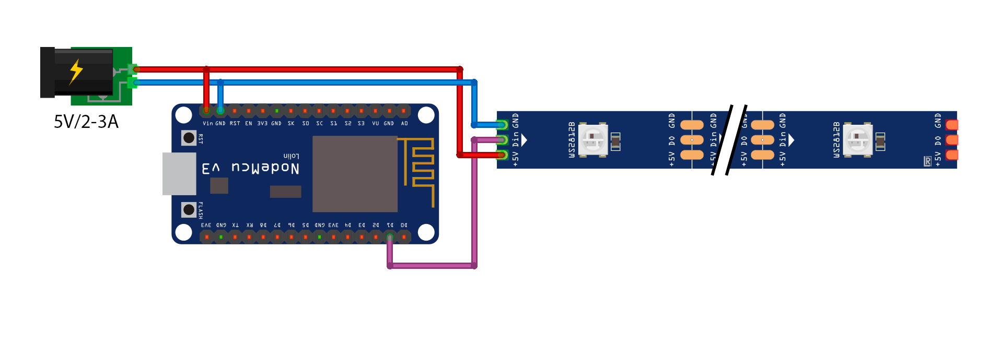

# smart-led-firmware

Firmware for controlling smart LED strip via Web GUI or serial port. Initially developed for NodeMCU v3.

## Hardware

-   NodeMCU v3 (or any other controller on ESP8266)
-   WS2812B LED strip (you can use any other, but you will have to adjust the sketch)
-   5V 2-3A Power supply (each LED consumes ~60 milliamps at its whitest color, so you might need to increase the current; **if you are not powering the microcontroller via USB, ensure it does not overheat**)

    **If the controller is connected via USB, disconnect VIN from the power supply. Keep GND common to the strip and the controller; otherwise, the control pin may become erratic.**



## Usage

-   Define your Wi-Fi SSID & password in the secrets.h:
    ```c
    #define WIFI_SSID     "SSID"
    #define WIFI_PASSWORD "PASSWORD"
    ```

## Web GUI

The source code for the Web GUI is stored [here](https://github.com/kd3n1z/smart-led-web-gui). This repository always contains the latest build (automatically updated via [Github Actions](https://github.com/kd3n1z/smart-led-web-gui/blob/main/.github/workflows/bump-firmware.yml))

## Dependencies

-   [ESP8266 boards](http://arduino.esp8266.com/stable/package_esp8266com_index.json)
-   [FastLED](https://github.com/FastLED/FastLED)
